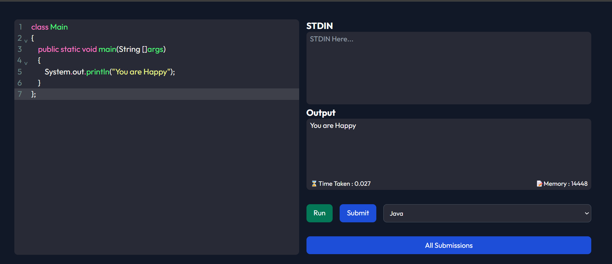
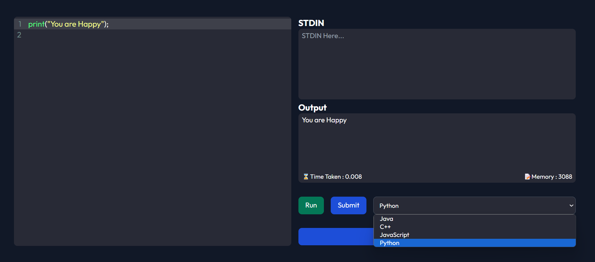

# CodePlay

CodePlay is a dynamic online coding platform designed to empower developers of all levels. With its robust Express.js backend and interactive React frontend, CodePlay offers a seamless environment for coding, collaboration, and creativity.

Java :




Python : 



## 🛠 Skills
- React.js
- Express.js
- CORS
- Javascript
- API handling
- tailwind-css-configs

### API Endpoints:
- **GET /submissions**: Retrieve all submissions.
- **POST /submissions**: Create a new submission.
- **GET /submissions/:id**: Retrieve a specific submission by its ID.

## Frontend

### Technologies Used:
- React
- React Router DOM
- React Hot Toast

### Setup:
1. Install dependencies using `npm install`.
2. Start the development server using `npm start`.
3. The frontend will be accessible on `http://localhost:3000`.

## Run Locally

Clone the project

```bash
  git clone https://github.com/Harshawardhan2209/CodePlay
```

Go to the project directory

```bash
  cd CodePlay
```

Install dependencies

```bash
  npm install
```

Start the server

```bash
  npm run start
```


## Contributing

Contributions are always welcome!

Please adhere to this project's `code of conduct`.


